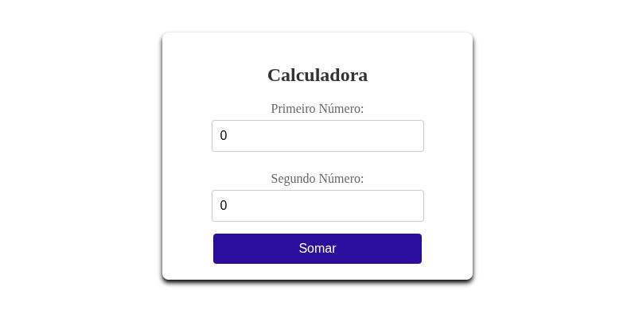

# Calculadora Angular



Este projeto é uma calculadora desenvolvida com Angular, criada como parte de uma revisão dos meus conhecimentos em Angular.

## Funcionalidades

- Operações básicas: adição
- Interface simples e intuitiva
- Design responsivo

## Tecnologias Utilizadas

- [Angular](https://angular.io/)
- TypeScript
- SCSS

## Como Executar o Projeto

1. **Clone o repositório:**
   ```bash
   git clone https://github.com/jonathan-matheus/angular-calculadora.git
   ```
2. **Instale as dependências:**
   ```bash
   npm install
   ```
3. **Inicie o servidor de desenvolvimento:**
   ```bash
   npm start
   ```
4. Abra o navegador em `http://localhost:4200` para acessar a calculadora.

## Estrutura do Projeto

```
calculadora/
├── src/
│   └── app/
│       └── calculadora/
│           ├── calculadora.ts
│           ├── calculadora.html
│           ├── calculadora.scss
│           └── calculadora.spec.ts
├── angular.json
├── package.json
└── ...
```

## Testes

Para rodar os testes automatizados:

```bash
npm test
```

## Autor

- Jonathan Matheus

## Referência

Este projeto foi desenvolvido durante o curso [Angular - Curso Completo do Iniciante ao Avançado](https://www.udemy.com/course/angular-curso-completo-do-iniciante-ao-avancado/?couponCode=MT260825G1) disponível na Udemy.

## Licença

Este projeto está sob a licença MIT.
